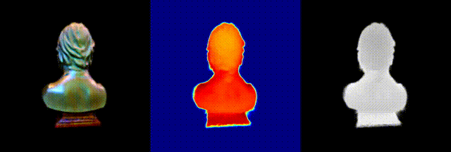
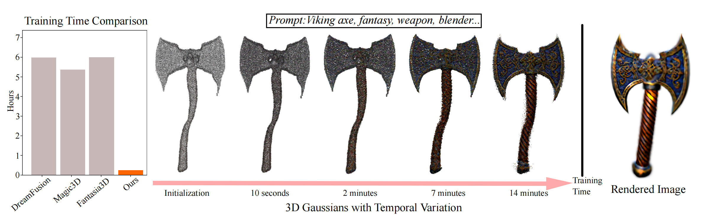

# GaussianDreamer: Fast Generation from Text to 3D Gaussians by Bridging 2D and 3D Diffusion Models
### [Project Page](https://taoranyi.com/gaussiandreamer/) | [arxiv Paper](https://arxiv.org/abs/2310.08529)

[GaussianDreamer: Fast Generation from Text to 3D Gaussians by Bridging 2D and 3D Diffusion Models](https://taoranyi.com/gaussiandreamer/)  

[Taoran Yi](https://github.com/taoranyi)<sup>1</sup>,
[Jiemin Fang](https://jaminfong.cn/)<sup>2‡</sup>, [Junjie Wang](https://scholar.google.com/citations?view_op=list_works&hl=zh-CN&user=9Nw_mKAAAAAJ)<sup>2</sup>, [Guanjun Wu](https://guanjunwu.github.io/)<sup>3</sup>,  [Lingxi Xie](http://lingxixie.com/)<sup>2</sup>, </br>[Xiaopeng Zhang](https://scholar.google.com/citations?user=Ud6aBAcAAAAJ&hl=zh-CN)<sup>2</sup>,[Wenyu Liu](http://eic.hust.edu.cn/professor/liuwenyu/)<sup>1</sup>, [Qi Tian](https://www.qitian1987.com/)<sup>2</sup> , [Xinggang Wang](https://xwcv.github.io/)<sup>1‡✉</sup>

<sup>1</sup>School of EIC, HUST &emsp;<sup>2</sup>Huawei Inc. &emsp; <sup>3</sup>School of CS, HUST &emsp; 

<sup>‡</sup>Project lead.  <sup>✉</sup>Corresponding author. 


In recent times, the generation of 3D assets from text prompts has shown impressive results. Both 2D and 3D diffusion models can help generate decent 3D objects based on prompts. 3D diffusion models have good 3D consistency, but their quality and generalization are limited as trainable 3D data is expensive and hard to obtain. 2D diffusion models enjoy strong abilities of generalization and fine generation, but 3D consistency is hard to guarantee. This paper attempts to bridge the power from the two types of diffusion models via the recent explicit and efficient 3D Gaussian splatting representation. A fast 3D object generation framework, named as GaussianDreamer, is proposed, where the 3D diffusion model provides priors for initialization and the 2D diffusion model enriches the geometry and appearance. Operations of noisy point growing and color perturbation are introduced to enhance the initialized Gaussians. Our GaussianDreamer can generate a high-quality 3D instance or 3D avatar within 15 minutes on one GPU, much faster than previous methods, while the generated instances can be directly rendered in real time.


## 🦾 Updates
- 12/6/2023: Update [arxiv paper](https://arxiv.org/abs/2310.08529).
- 11/27/2023: Update colab and huggingface demo.
- 11/27/2023: Release the results initialized using point clouds with ground. And now we support importing the generated 3D assets into the Unity game engine with the help of [UnityGaussianSplatting](https://github.com/aras-p/UnityGaussianSplatting). See the [Project Page](https://taoranyi.com/gaussiandreamer/) for details.
- 10/24/2023: Release the results initialized using SMPL. See the [Project Page](https://taoranyi.com/gaussiandreamer/)  for details.
- 10/21/2023: Fixed some installation issues, thanks to Sikuang Li, [Tawfik Boujeh](), and [ashawkey](https://github.com/ashawkey/diff-gaussian-rasterization). You can view the detailed information in branch diff.
- 10/16/2023: The rough code has been released, and there may still be some issues. Please feel free to raise issues. 

## 😀 Demo
Huggingface demo: <a href="https://huggingface.co/spaces/thewhole/GaussianDreamer_Demo"></a>

Colab demo: [](https://colab.research.google.com/github/taoranyi/GaussianDreamer-colab/blob/main/GaussianDreamer_colab.ipynb) (Thanks [camenduru](https://github.com/camenduru/GaussianDreamer-colab).)


## 🏁 Get Started
**Installation**
Install [3D Gaussian Splatting](https://github.com/graphdeco-inria/gaussian-splatting) and [Shap-E](https://github.com/openai/shap-e#usage) as fellow:
```
pip install torch==2.0.1+cu117 torchvision==0.15.2+cu117 torchaudio==2.0.2 --index-url https://download.pytorch.org/whl/cu117
pip install ninja
pip install -r requirements.txt

git clone https://github.com/hustvl/GaussianDreamer.git 
cd GaussianDreamer

pip install ./gaussiansplatting/submodules/diff-gaussian-rasterization
pip install ./gaussiansplatting/submodules/simple-knn

git clone https://github.com/openai/shap-e.git
cd shap-e
pip install -e .
```
Download [finetuned Shap-E](https://huggingface.co/datasets/tiange/Cap3D/tree/main/our_finetuned_models) by Cap3D, and put it in `./load`

**Quickstart**

Text-to-3D Generation
```
python launch.py --config configs/gaussiandreamer-sd.yaml --train --gpu 0 system.prompt_processor.prompt="a fox"

# if you want to import the generated 3D assets into the Unity game engine.
python launch.py --config configs/gaussiandreamer-sd.yaml --train --gpu 0 system.prompt_processor.prompt="a fox" system.sh_degree=3 
```

Text-to-Avatar Generation
```
python launch.py --config configs/gaussiandreamer-sd.yaml --train --gpu 0 system.prompt_processor.prompt="Spiderman stands with open arms" system.load_type=1

# if you want to import the generated 3D assets into the Unity game engine.
python launch.py --config configs/gaussiandreamer-sd.yaml --train --gpu 0 system.prompt_processor.prompt="Spiderman stands with open arms" system.load_type=1 system.sh_degree=3 
```


**Application**

Import the generated 3D assets into the Unity game engine to become materials for games and designs with the help of [UnityGaussianSplatting](https://github.com/aras-p/UnityGaussianSplatting).


## 📑 Citation
If you find this repository/work helpful in your research, welcome to cite the paper and give a ⭐.
Some source code of ours is borrowed from [Threestudio](https://github.com/threestudio-project/threestudio), [3DGS](https://github.com/graphdeco-inria/gaussian-splatting), [depth-diff-gaussian-rasterization](https://github.com/ingra14m/depth-diff-gaussian-rasterization). We sincerely appreciate the excellent works of these authors.
```
@article{GaussianDreamer,
        title={GaussianDreamer: Fast Generation from Text to 3D Gaussian Splatting with Point Cloud Priors},
        author={Taoran Yi and Jiemin Fang and Guanjun Wu and Lingxi Xie and Xiaopeng Zhang and Wenyu Liu and Qi Tian and Xinggang Wang},
        journal={arxiv:2310.08529},
        year={2023}
        }
```
